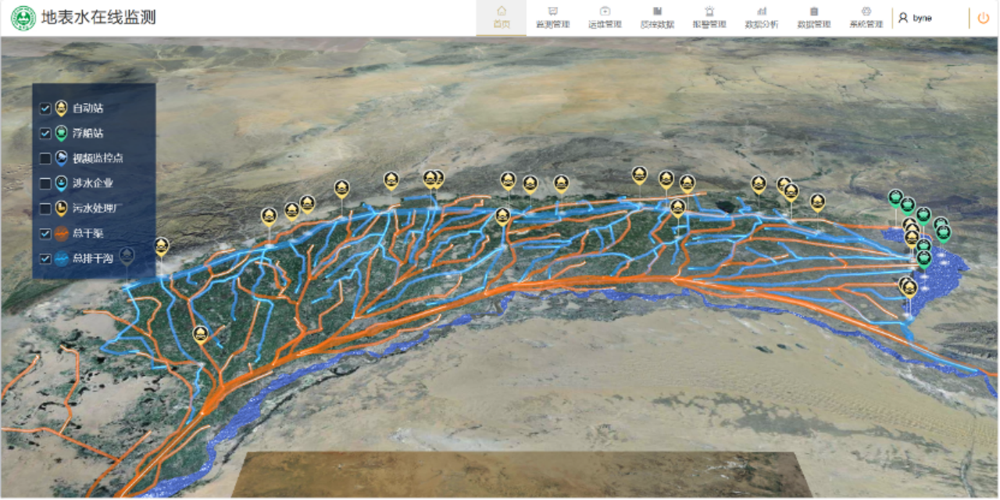
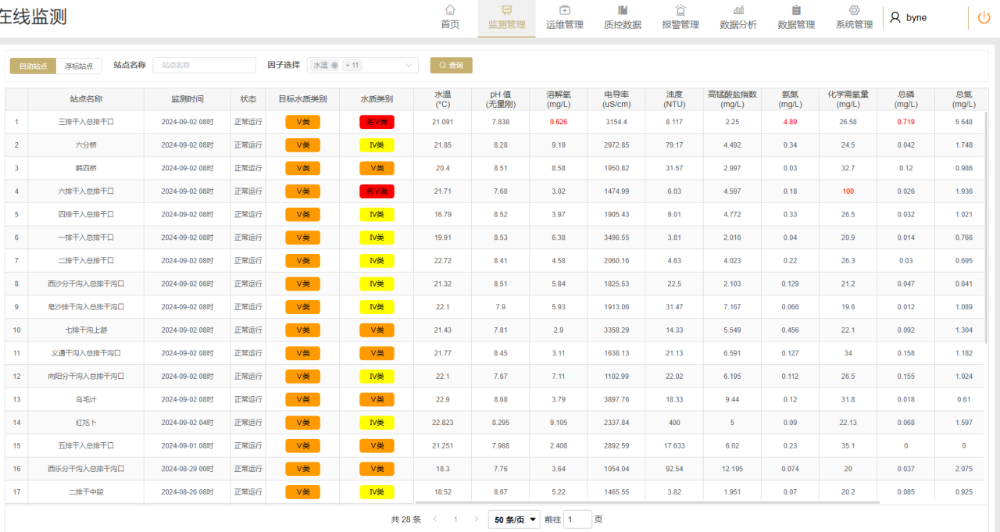
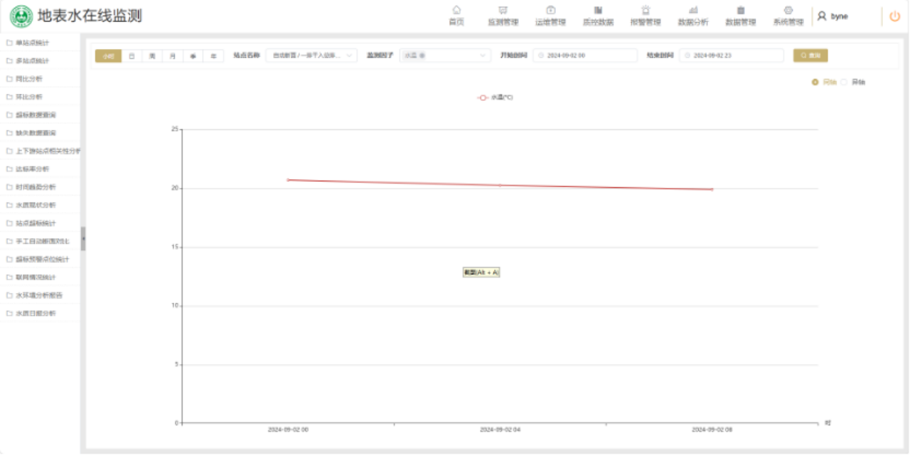
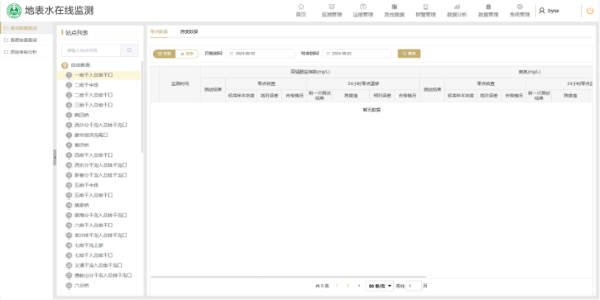
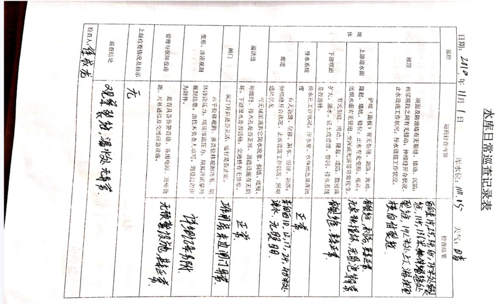
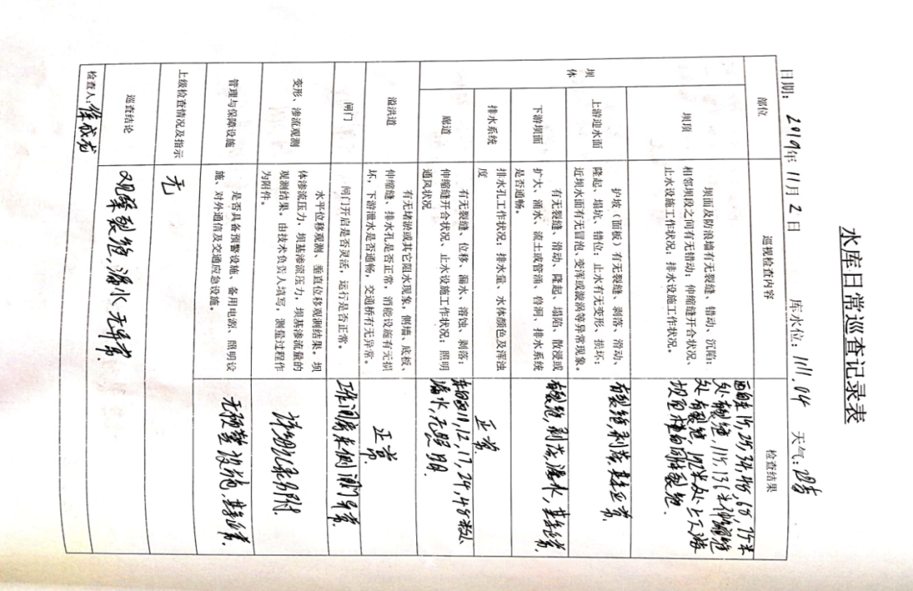
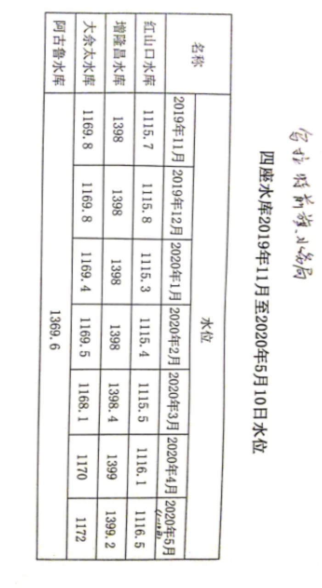
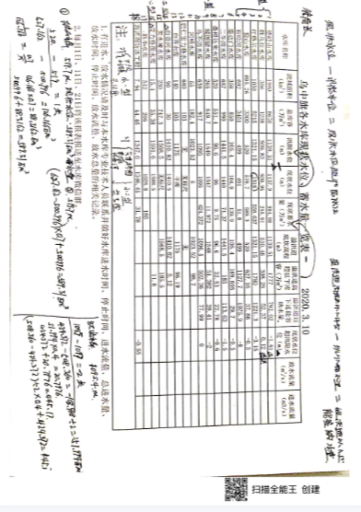
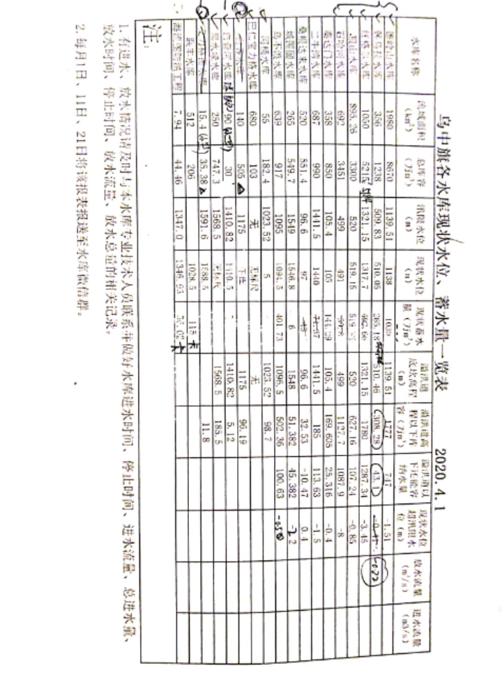

# 生态环境数据中存在的问题
## 一、数据

平台水数据特点：目前水数据主要采集水中污染物含量数据，水域遥感图像数据。污染物含量数据采集上报后，进行人工处理，人为进行分析；遥感数据可以用来识别，例如实现黄苔动态分布、黄苔致灾指数、黄苔生长曲线等要素监测。
收集的数据还包括，河流水位数据，排干口排水量数据。
总结，平台主要作用是收集数据，并更加直观展示数据，专业人员再对数据进行人工分析，用来辅助决策。平台主要用来收集和展示数据，并未对数据进行过多处理，对数据的应用停留在起始阶段。对此，工作人员表示大多数平台都停留在此阶段，没有对数据进行太多处理，主要还是在如何将数据更好收集和展示，来更好辅助决策，他们想使用知识图谱也是为了更好的展示数据。

## 二、论文中问题及其解决方案
### 问题一
问题：面向新时代生态环境保护过程中积累的多模态数据（如文本、视频、照片等），如何将些数据进行有效整理，并通过知识图谱的方式加以利用，来提升生态环境治理的效率。[^1]
解决方案：将深圳市的“散乱污”企业整理成功案例及生态环境损害赔偿案件作为数据源，通过数据整合、知识抽取、知识融合等步骤，构建了一个包含 12 类本体、82 个实体、4 类 201 条关系的生态管理知识图谱。
###  问题二
问题：目前的知识图谱构建方法在充分利用文献文本资源以及在专业领域（生态 环境）中的应用不足。[^2]
解决方案：提出了一种自动化的生态环境领域知识图谱构建方法。首先，通过OCR文本识别和PDF文本提取技术，从生态环境领域的期刊文献中收集文本数据，构建文献语料库。随后，通过领域知识图谱模式层的构建、语料库的语义标注、知识的自动抽取以及知识验证等技术，完成知识图谱的自动化构建。
   1. 数据来源：2014-2020 年在《生态学报》《环境科学》等专业生态环境领域中文期刊见看的 5000 多篇文献。
   2. 领域知识图谱模式层建立：UMLS 是一种工具化、集成化、跨领域的语言系统。通过将 UMLS 的顶层概念（图 1）与提取的领域关键词和关系相结合，构建生态环境领域知识图谱的模式层参照UMLS体系，将领域知识体系在顶层概念中分为概念实体、物理实体、现象过程和活动 4 个实体，含义分别为人类主观认知的实体，客观存在的实体，唯物的、无意识的自然现象，计划性的、可归因的人类行为。通过对生态环境领域关键词和关系的归类，归纳得到生态环境实体列表与关系列表（图 2，图 3）。
   3. 领域语料库建立：通过标注实体和标注关系，公标注了 40 万字的语料，其中实体类别标签 2.2 万条，关系类别标签 1.1 万条。
   4. UMLS（统一医学语言系统）是一种工具化、集成化、跨领域的语言系统。

### 问题三
问题：多学科深度交叉融合是大趋势，但目前在生态环境领域，通过大量文献文本与互联网文本自动化构建知识图谱的方法还少有研究。生态环境相关的文献期刊中包含大量的**碎片化信息**和**隐式知识**，目前还未有效果较好的**自动化挖掘方法**。[^3]
解决方案：面向文献文本的生态环境领域知识图谱构建研究，提出了文献文本驱动的领域知识图谱构建方法。以生态环境领域文献资料为主要数据源，通过文献文本数据抓取、结合机器学习的本体建模、基于深度学习技术的信息抽取、知识验证以及原型工具开发的知识图谱构建与应用。
   1. 数据抓取：抓去了 5021 篇生态环境相关文献文本，在通过统计学习方法统计了 T1000 的生态环境概念关系，在此基础上通过专家咨询和归纳总结，构建了生态环境领域知识信息模型
   2. 通过自建的标注软件，构建了 40.7 万字共计 2.2 万条的生态环境命名实体与 1.1 万条生态环境领域实体关系的语料库
   3. 通过算法讲 1000 段生态环境文本进行提取，最终得到了 29490 条知识三元组。
   4. 对抽取的知识三元组集合通过知识融合和知识验证方法进行质量控制后存储到图数据库中。
   5. 数据特点：这些生态环境大数据既包含结构化的监测统计数据，又包含大量的非结构化数据。据有关研究统计，非结构化数据约占总数据量的 80%。。其中包含生态环境学家对生态环境的调查 和研究形成的大量文本文献和互联网文本，这些非结构化的文本数据是我们进行 环境治理的重要参考信息。特别是生态环境相关的期刊，经过生态环境领域专家的总结和提炼，具有表达形式规范、知识点相对密集、更新速度快的特点。这些数据为生态环境大数据中的重要来源，包含大量碎片化的信息与隐式知识。
### 问题四
问题：自然资源领域数据种类繁多，业务复杂。在大数据时代，面对信息爆炸的挑战，如何从海量数据中提取有价值的数据、信息和业务知识，以有效辅助管理决策，是有待解决的问题[^4]
解决方案：提出了自然资源领域知识图谱构建的技术框架，包含知识抽取、知识融知识加工三个方面。
   1. 自然资源领域知识来源包括基础地理数据、信息化成果、文件材料、第三方数据、互联网公开数据。1、2 项作为核心数据源。
   2. 通过（Database to Resource Description Framework,D2R）工具，关系表转化为三元组。
   3. 本文整理的地理空间关系与自然语言描述对应关系。如图

### 问题五
问题：随着经济不断发展，洞庭湖环境破坏越来越严重，湖泊面积、湿地植被面积和珍惜鱼类逐渐减少，入湖氮磷污染增加，因此通过构建洞庭湖保护区的知识图谱刻不容缓。[^5]
解决方案：通过搭建洞庭湖生态环境监测系统的知识图谱来解决洞庭湖生态环境保护问题。
   1. 数据收集与挖掘：通过洞庭湖天地空一体化的生态环境监测系统，获取海量数据，再多源数据融合（政府网站、百度百科站点挖掘的数据）。
   2. 使用文本解析、模板抽取、机器学习等方法，获取模式中的类别实体
   3. 通过爬虫、文本解析等方法，获取模式中定义的属性关系，并通过数据解析、相似度计算等方法获取其语义关系
   4. 利用 Jaccard 技术对获取的三元组关系进行知识融合，利用知识推理方法对获取的实体和实体语义关系进行知识加工，完成知识图谱的构建
# 引用文献
[^1]: 郑晓云,董仁才,练岸鑫,等.基于多模态生态治理数据构建生态管理知识图谱技术[J].生态学报,2024,44(09):3924-3933.DOI:10.20103/j.stxb.202307091480.CSCD
[^2]: 王天一,孟小亮,张华.一种面向生态环境领域的知识图谱构建方法[J].地理空间信息,2023,21(01):14-19.（普刊）
[^3]: 张华.面向文献文本的生态环境领域知识图谱构建研究[D].武汉大学,2022.DOI:10.27379/d.cnki.gwhdu.2022.000561.硕士论文
[^4]: 黄诗颖,黄涛.自然资源领域知识图谱构建与应用研究[J].自然资源信息化,2023,(04):53-59.普刊
[^5]: 陈兰鑫.洞庭湖生态环境监测系统知识图谱的构建[D].湖南农业大学,2019.DOI:10.27136/d.cnki.ghunu.2019.000417.硕士论文

